# Introduction

With or without our knowledge and permission, the are thousands of packets of digital information being sent out and received every minute. That being said, it is important to keep in mind that not all information is transferred the same way. This brings forth the concept of protocols. CompTIA defines network protocols as “an established set of rules that determine how data is transmitted between different devices in the same network.” For instance, the Transmission Control Protocol (TCP) defines the way information is exchanged between senders and receivers (IBM) whereas the Address Resolution Protocol (ARP) is in charge of taking the name address of a machine and translating it into a usable address for a network (Techopedia). This lab is dedicated to capturing packets that use these protocols and analyzing both their function and role in a network. 

## Introducing and Installing Wireshark

The tool I will be using to capture packets in this lab is a free and open-source software known as Wireshark. The official website’s “about” page describes the program as “the world’s largest foremost and widely-used network protocol analyzer and views networks at microscopic levels” (Wireshark). The program is capable of capturing and deeply inspecting hundreds of protocols, capturing live network activity, allowing offline analysis, and reading live data from Ethernet connections. The program also has other uses such as detecting DoS attacks and grabbing passwords from passing File Transfer Protocol (FTP) packets. However, this lab is only concerned with surface-level analysis of basic internet traffic. Moreover, true to its reputation, this is an extremely popular piece of software and I have used it several times already for my other information systems classes. Nevertheless, the version I already had installed was due for an update, so I installed a fresh version of the program from Wireshark’s website. After launching it, I am taken to the program’s home page where I decide which network will be used for capturing.

## Explaining My Internet Connection and Illustrating My Network Architecture

Before I begin to capture network activity, it is important to first understand how my network is laid out. When my house was being built, all the network architecture has handled by AT&T. They had designed our connections such that only AT&T would be able to repair or modify them. Throughout my house are ethernet ports which join into two switches which connect to an AT&T U-verse router which is then connected to the house’s phone line. Additionally, the router connects to an AT&T Wireless Access Point (WAP).

In 2020, however, my family and I had noticed that our wired connections have been exceedingly bad for quite some time. The support technicians at AT&T had insisted that we had the fastest internet plan available, but only a few simple internet speed tests proved this to be a lie. Although our phone service was excellent, our internet connections were not. We eventually got fed up and opted to switch to Spectrum. However, my parents still wanted to keep AT&T for our phone service. The result was having a Spectrum modem and router crudely installed alongside the AT&T U-verse router and WAP. The Spectrum technicians stated that they could not do any more to modify the network due to the way AT&T had initially set it up. It works well, but the tradeoff was that all the ethernet ports in my house are now totally useless (and we have one of the ugliest network boxes you have ever seen). This was mostly fine since nothing except my computer really used ethernet anymore. Of course, I still wanted a wired connection and thankfully the network box is in my closet. My solution was to plug an ethernet cable into my desktop computer, run it across my room, and plug the other end into the Spectrum router. The router is then connected to the modem which is connected to the internet. The figure below shows an illustration of this:

- <i>Figure 1</i>: An illustration of my computer’s network. My computer is joined to the router via ethernet cable. The router is connected to the modem which then connects to the internet.

<p align="center">
  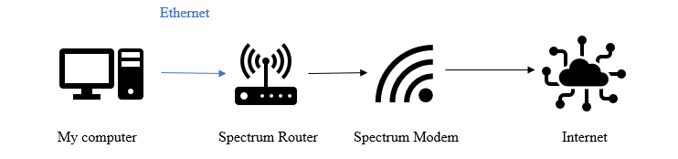
</p>

One final detail of my network setup is that my computer is not able to connect to Wi-Fi. Therefore, its only available connection is through ethernet. This information about my network is pertinent because it explains the selection of connections Wireshark displays.

## Beginning to Use Wireshark and Capturing the Network Activity from Accessing a Single Website

Upon opening Wireshark, I am greeted by a home page and a list of connections to monitor.

- <i>Figure 2</i>: The connection selection area. There are three unused local area connections, an adapter for loopback traffic capture, and two ethernet connections labeled “Ethernet 5” and “Ethernet” respectively. Notice the lack of activity for the “Ethernet” connection.

<p align="center">
  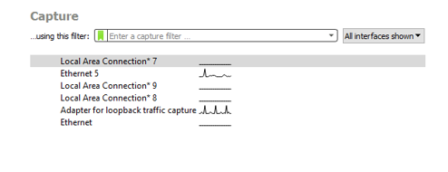
</p>

When I was first performing this step, I selected the connection labeled only “Ethernet.” However, I quickly discovered that there was absolutely no activity going on within it. No packets whatsoever were being sent or received. It was then I noticed a second ethernet connection labeled “Ethernet 5.” I suspect that the “Ethernet” connection is referring to the ethernet port AT&T put in my wall (which is now defunct), and the “Ethernet 5” connection is the setup I have right now with the Spectrum hardware. Therefore, this lab will be focusing on the “Ethernet 5” connection because it is what connects my computer to the internet.

With this connection selected, I close out any browser windows and potential internet-based services I have and hit the “start capturing” button. After doing so, I open Firefox and access YouTube. I kept the process running for about two minutes and then hit “stop.” The figure below is a snippet of the capture:

- <i>Figure 3</i>: A snippet of my first capture. Shown here are TCP connections that appear when connecting to the website and staying there. There is also a message being sent with ICMPv6 along with Multicast Domain Name System (MDNS) packets, however these are insignificant because they pertain to my phone.

<p align="center">
  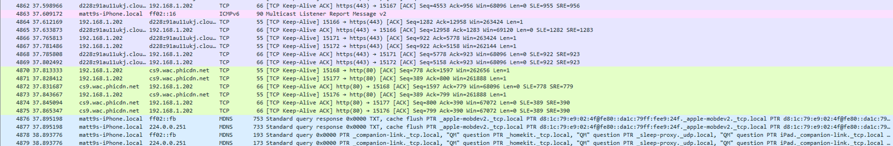
</p>

I found it astonishing that even for such a short amount of time, there was a large amount of information Wireshark had captured. Among these are packets from Firefox and Google. There is also a large amount of TCP packets that are used to establish and maintain a connection with the destination. I also found it striking that, despite my computer using a wired connection, packets from my cell phone have also been captured. My only guess is that information on YouTube is being synced between my computer and phone. I find these observations to be significant because it shows the user how there is a lot more information being sent out and received than he or she may think.

## Using Wireshark to Capture Activity While Accessing a Remote Service

The next section of the lab consists of analyzing network activity when accessing a remote service. Cisco subsidiary AppDynamics defines a remote service as “a process that resides outside of the application server and provides a service to the application.” Examples of a remote service includes web services, message queues, and caching servers. Furthermore, a web service is a medium that propagates communication between client and server applications on the World Wide Web. It is a software module that is designed to perform a specific set of tasks (Guru99). With these definitions in mind, the remote service I chose to use was Steam which is a digital gaming distribution service owned by the gaming company Valve. The structure of Steam is based almost entirely around communications between client computers and central Steam servers. Moreover, content delivery is performed by transferring games and other files through large software libraries known as game cache files or GCFs (Wikipedia). This, in addition to the Steam Cloud service, is why I believe Steam to be a suitable means for demonstration in this lab.

After clearing Wireshark, I restart the capturing process and log on to my Steam profile. Interestingly, this took three attempts because the connection was lost each time. This may have been due to the amount of usage coming from Wireshark. The figure below shows the first half of the information captured in the process:

- <i>Figure 4</i>: TCP (and TLS) packets that are captured when logging on to Steam. These demonstrate the connection that is being established between my computer and Steam (which is, more specifically, the nearest Akamai Ghost server for Steam).

<p align="center">
  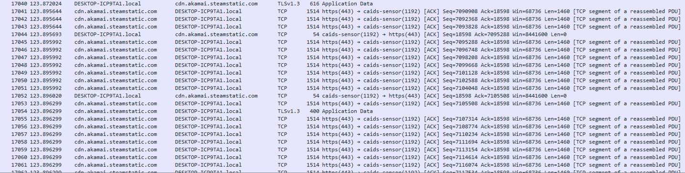
</p>

This figure is showing many TCP packets being sent and received between DESKTOP-ICP9TA1, which is the name of my computer, and cdn.akamai.steamstatic.com. Although the Steam developers do not disclose the specifics of their software, I have gathered that Steam uses a service known as Akamai Ghost (otherwise known as Akamai G-Host or Akamai Global Host). Akamai’s official website explains that this service mirrors content from a central server to a server that is closer to a given client. This, in turn, makes content delivery more efficient. Therefore, I can conclude that the Akamai packets are what Steam is using to communicate with me.

Next, the second half of the capture is shown below:

- <i>Figure 5</i>: The next part of the connection process. A three-way handshake can be seen between my computer and the Steam Cloud server. Moreover, a connection to another Akamai service is established.

<p align="center">
  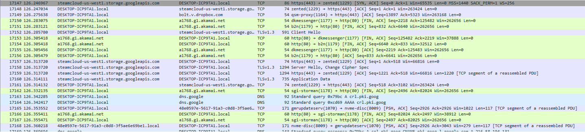
</p>

This section shows a connection being established with steamcloud-us-west1.storage. googleapis.com. This is me connecting to the Steam Cloud server in which my games and content are stored not only on my computer, but also in one of Valve’s servers in my region. The next connection is to a1768.gi.akamai.net. Judging by the information panel, and my own knowledge of the program, I suspect that this is handling the social components of Steam. That is, messaging, screenshots, community sharing, and so on. Since this information only repeats after this point, I decide that this is all I will gather from this step and move on.

## Running a One-Hour Capture and Collecting Packets with Various Protocols

This intensive step of the lab consists of restarting my network connection and running a Wireshark capture for one hour while performing various tasks on my computer in order to capture the protocols that are required in the directions. Actions I took to achieve this included visiting YouTube (opening a video and joining a stream), logging into Discord (a messaging site) and Blackboard, accessing Google, visiting Quora and Wikipedia, and opening SimSpace and accessing a Kali Linux terminal. In addition to all this, I also logged back into Steam and even ran one of my games and joined a server. I wanted to perform as many actions as I could so that I could see the variety of ways Wireshark reflects network activity. The figures below show the network connection statistics and network packet summary. The subsections thereafter discuss each protocol in the order given in the directions.

- <i>Figure 6</i>: The capture file properties of my one hour scan. Notice that the time elapsed is approximately one hour and the total number of bytes captured and displayed is shown in the bottom third of the figure. Compared to number of bytes my firewall states, the results are accurate.

<p align="center">
  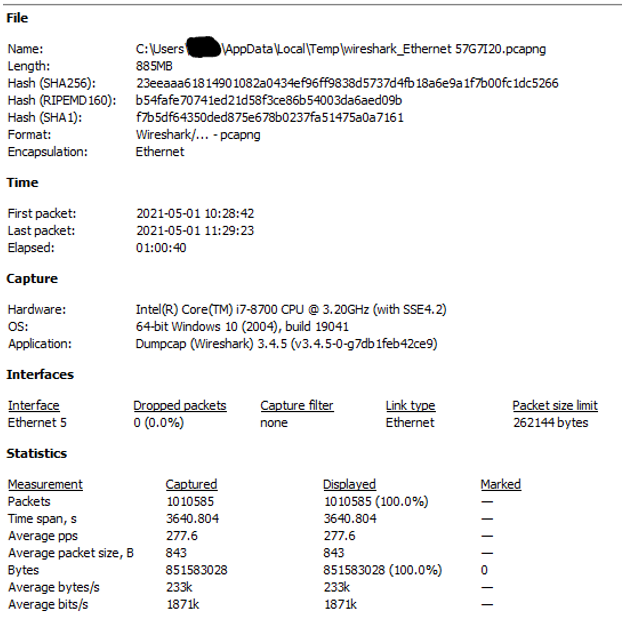
</p>

- <i>Figure 7</i>: The statistics of the packets captured. This displays all the different packet protocols that were captured. Notice how a vast majority of it is TCP and that all of these packets come entirely from Ethernet.

<p align="center">
  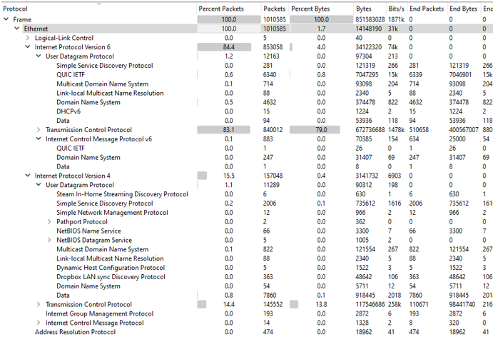
</p>

### ARP

As previously mentioned, ARP protocols take the name of a machine and translate it so that it is usable in a network. That is, an IP address is mapped to the machine’s MAC address. It does so by asking the entire network for a desired IP address and waiting for an answer from the intended node. Note that the request is ignored by every destination on the network except for the intended recipient (Study-CCNA). The figure below shows the ARP interactions with the devices in my network.

- <i>Figure 8</i>: A snippet of my one-hour capture with the ARP filter in place. Here we can see the MAC addresses of the devices on my network along with their resolving IP addresses. This fragment covers the scope of this capture because this information repeats after the cutoff.

<p align="center">
  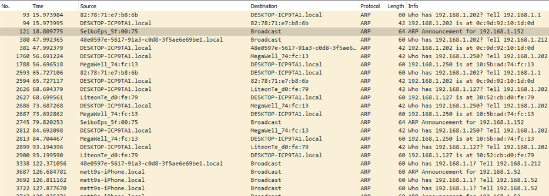
</p>

This next figure shows a more organized list of all the MAC addresses that appear in the capture file along with a few statistics regarding the communications between devices.

- <i>Figure 9</i>: A list of the MAC addresses that appear in the capture file. The highlighted entries denote my computer’s MAC address. The side panels show the number of packets that were transferred between addresses during their communications.

<p align="center">
  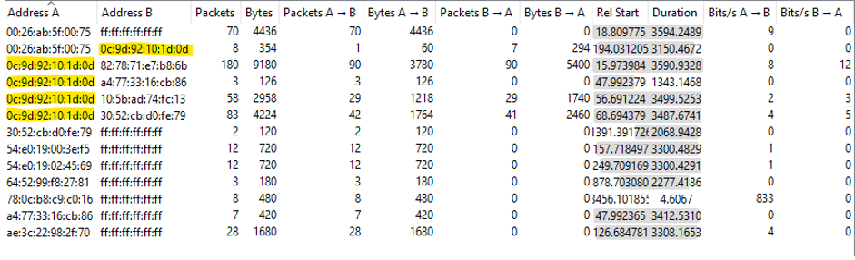
</p>

### TCP

Once again, the TCP defines the way information is exchanged between senders and receivers. I noticed throughout my captures that packets with TCP are by far the most abundant. From my understanding, this is to be expected because this is what establishes and maintains connections between the client and the server. The figures below show two instances TCP is used to transfer information.

- <i>Figure 10</i>: A snippet of TCP interaction while watching a video on Tumblr and simultaneously streaming music on YouTube.

<p align="center">
  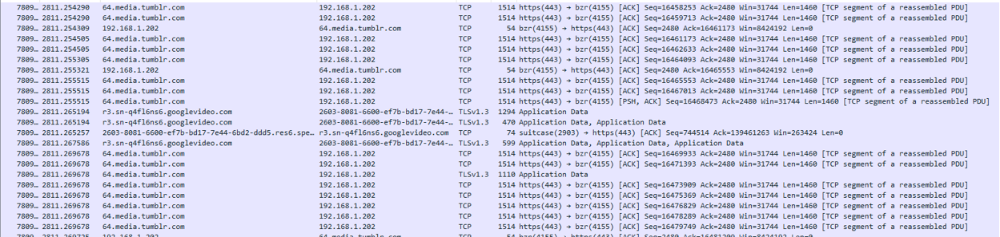
</p>

- <i>Figure 11</i>: Another snippet of TCP interaction, this time accessing my Gmail account. Notice how the service is using the Internet Message Access Protocol, or IMAP, to show me my emails.

<p align="center">
  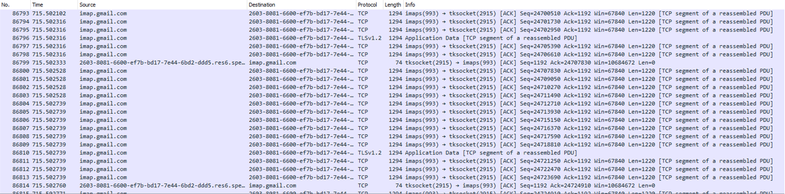
</p>

### UDP

The User Datagram Protocol, or UDP, is a communication protocol that is very similar to TCP. The only difference is that UDP communications do not formally establish a connection before transferring data (Cloudflare). As a result, this means UDP does not have any error checking and data can therefore be transferred at a much faster speed than TCP. The tradeoff, however, is that UDP packets can potentially be lost in transit and create vulnerabilities for DDoS attacks. I found a particularly interesting example for this protocol. The following figure shows the network activity as I ran my game and joined one of Valve’s dedicated servers.

- <i>Figure 12</i>: A capture from Wireshark showing me connecting to one of Valve’s dedicated servers on my game. The IP addresses are between my computer and Valve’s server.

<p align="center">
  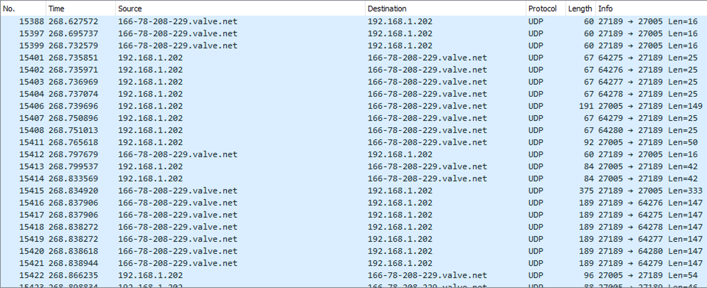
</p>

To illustrate even further, similar data is reflected in the game’s own developer console.

- <i>Figure 13</i>: A few entries from my game’s developer console after connecting to the server. Notice the similarities in the IP addresses.

<p align="center">
  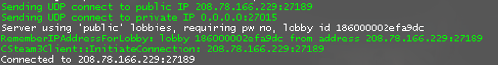
</p>

### HTTP

The Hypertext Transfer Protocol, or HTTP, allows the fetching of resources such as HTML files, images, videos, and advertisements (Mozilla). Its main function is to take data and translate it such that humans are able to interpret it. The figure below shows the transferring of HTTP packets in order to load the main page of my Steam profile.

- <i>Figure 14</i>: The HTTP interactions that were captured while my profile page was loading. Once again, I must connect to the Akamai servers. Notice how HTTP is being used to access both a large and medium version of my profile picture from one of Steam’s media directories.

<p align="center">
  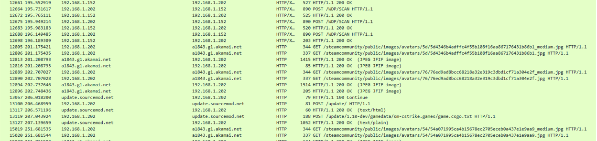
</p>


### Header 3

```js
// Javascript code with syntax highlighting.
var fun = function lang(l) {
  dateformat.i18n = require('./lang/' + l)
  return true;
}
```

```ruby
# Ruby code with syntax highlighting
GitHubPages::Dependencies.gems.each do |gem, version|
  s.add_dependency(gem, "= #{version}")
end
```

#### Header 4

*   This is an unordered list following a header.
*   This is an unordered list following a header.
*   This is an unordered list following a header.

##### Header 5

1.  This is an ordered list following a header.
2.  This is an ordered list following a header.
3.  This is an ordered list following a header.

###### Header 6

| head1        | head two          | three |
|:-------------|:------------------|:------|
| ok           | good swedish fish | nice  |
| out of stock | good and plenty   | nice  |
| ok           | good `oreos`      | hmm   |
| ok           | good `zoute` drop | yumm  |

### There's a horizontal rule below this.

* * *

### Here is an unordered list:

*   Item foo
*   Item bar
*   Item baz
*   Item zip

### And an ordered list:

1.  Item one
1.  Item two
1.  Item three
1.  Item four

### And a nested list:

- level 1 item
  - level 2 item
  - level 2 item
    - level 3 item
    - level 3 item
- level 1 item
  - level 2 item
  - level 2 item
  - level 2 item
- level 1 item
  - level 2 item
  - level 2 item
- level 1 item

### Small image


### Large image


### Definition lists can be used with HTML syntax.

<dl>
<dt>Name</dt>
<dd>Godzilla</dd>
<dt>Born</dt>
<dd>1952</dd>
<dt>Birthplace</dt>
<dd>Japan</dd>
<dt>Color</dt>
<dd>Green</dd>
</dl>

```
Long, single-line code blocks should not wrap. They should horizontally scroll if they are too long. This line should be long enough to demonstrate this.
```

```
The final element.
```
